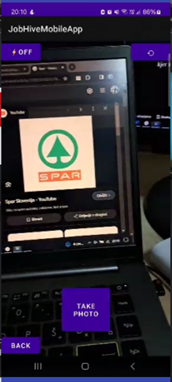
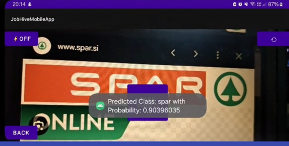

# [CameraX](https://developer.android.com/training/camerax) :camera:
**CameraX** je Jetpack knjižnjica namenjena poenostavljeni implementaciji uporabe kamere za različne namene v ANDROID (ne pa tudi IOS) aplikacijah. Razvili so jo in jo še vedmo razvijajo Googlovi razvijalci. 

## Zakaj CAMView?
Knjižnjica omogoča enostavno implementacijo uporabe kamere v lastni aplikaciji. Knjižnjica ponuja predpripravljen API, ki ponuja komaptibilnost vse od OS Android 5.0.
S tem pokrije okoli 98% vseh aktivnih Android naprav (glede na podatke iz leta 2023). Knjižnjica omogoča:
1. Direkten predogled slike s kamere;
2. Zajem slike;
3. Zajem video posnetka;
4. Analizo slike;

Knjižnjica je zasnovana tako, da razvijalcu poenostavi integracijo kamere v lastno aplikacijo. Na uradni [spletni strani](https://developer.android.com/training/camerax#broad-device-coverage) je ponujenih kar nekaj primerov implementacij kamere z različnimi funkcionalnostmi.

## Prednosti in slabosti

| PREDNOSTI :heavy_plus_sign:                                                 | SLABOSTI :heavy_minus_sign:                                                                                                             |
|-----------------------------------------------------------------------------|-----------------------------------------------------------------------------------------------------------------------------------------|
| Enostvana implementacija knjižnjice v svojo aplikacijo.                     | Manjka direktna implementacija skeniranja in prepoznavanja črtnih in QR kod.                                                            |
| Enostavna uporaba kamere za zajem slik in videoposnetkov ter analize slike. | Naprednejšim razvijalcem morda preveč poenostavljena kalupasta oblika. Za te bolj primerna Camera2.                                     |
| Redno posodabljanje knjižnjice.                                             | Ni mogoč zajem posnetkov z 120FPS+ in slow-motion.                                                                                      |
| Nenehno testiranje kompatibilnosti knjižnjice z novimi napravami.           | Ne podpira multi-cams (več kamer in premikanje med njimi - zoom), menjavanje sprednja/zadnja kamera med snemanjem ni mogoče (trenutno). |

## [Licenca](https://source.android.com/license) :page_with_curl:
Knjižnjica je licencirana pod Apache 2.0 licenco, kot večina drugih odprtokodnih android knjižnjic. 

## Zanimivi podatki

| Kategorija                  | Podatek                                                                  |
|-----------------------------|--------------------------------------------------------------------------|
| Zadnja psodobitev           | 13.12.2023                                                               |
| Verzije in vzdrževanje      | Redno posodabljanje - skoraj enkrat mesečno                              |
| Število uporabnikov         | ?                                                                        |
| Še druge podobne knjižnjice | Camera2, Camera (zastarelo - deprecated), CameraKit-Android, Fotoapparat |

**[Monzo](https://developer.android.com/stories/apps/monzo-camerax)** - fotografiranje osebnega dokumenta in selfie posnetka za preverjanje identitete uporabnika. V primerjavi s knjižnjico Camera2 (low-level API) so s pomocjo knjižnjice CameraX obseg kode zamnjšali za prd. 9000 vrstic kode in za kar 5-krat popravili rezultat izgubljenih stran na podalgi čudnega vedenja aplikacije na določenih napravah. 
**[Microsoft Lens](https://developer.android.com/stories/apps/microsoft-camerax)** - je primer aplikacije, ki je s pomočjo knjižnjice CameraX razvijalcem in uporabnik izboljšala uporabniško izkušnjo. V primerjavi s knjižnjico Camrea2 (low-level API) so s pomočjo knjižnjice CameraX dosegli do 30% krajši integracijski čas in do 2-krat manjši čas od zagona aplikacije do zajema slike. 

[Povezava](https://developer.android.com/codelabs/camerax-getting-started#0) do spletne strani Codelabs, kjer je prikazana uporaba knjižnjice in osnovni primeri uporabe.

## Gradle elementi

```gradle
dependencies {
    val camerax_version = "1.3.1";
    implementation ("androidx.camera:camera-core:${camerax_version}")
    implementation ("androidx.camera:camera-camera2:${camerax_version}")
    implementation ("androidx.camera:camera-lifecycle:${camerax_version}")
    implementation ("androidx.camera:camera-video:${camerax_version}")
    implementation ("androidx.camera:camera-view:${camerax_version}")
    implementation ("androidx.camera:camera-extensions:${camerax_version}")
}
```

## Primer aplikacije


## Implementacija v projekt





